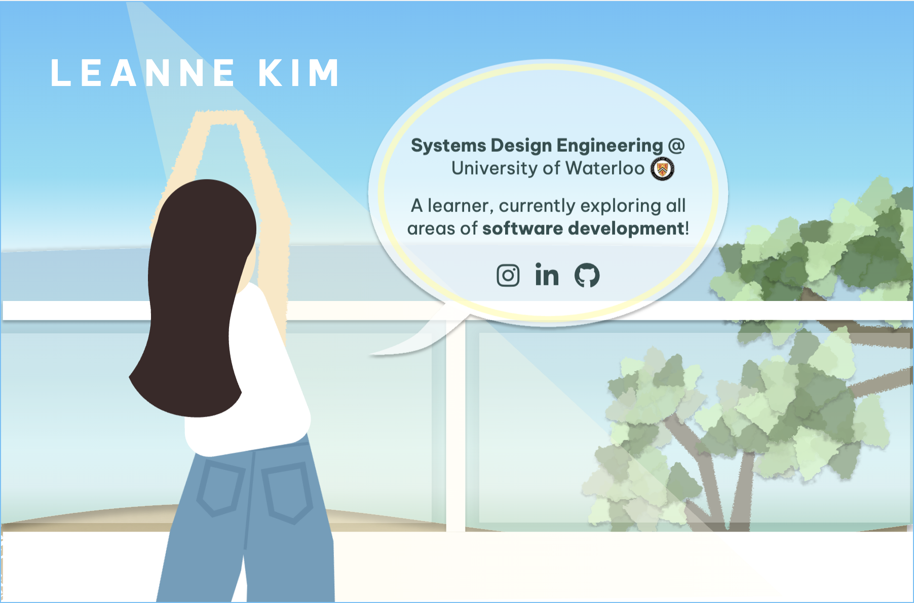

# [sooyeunleanne.github.io](sooyeunleanne.github.io)

A modern, interactive personal portfolio website built with Angular 20, TypeScript, HTML, and CSS, designed to showcase my projects, skills, and experiences.

## Preview

## Code scaffolding

The design was first created in [Figma](https://www.figma.com/design/26rVJG7bq6akExTgGVCuXs/sooyeunleanne.github.io?node-id=0-1&p=f&t=BFKndKSUmvtoDUTE-0), then developed into a responsive, animated web application.

## Features

- Custom UI inspired by Figma design
- Smooth animations and interactive components
- Responsive layout for desktop and mobile
- Project showcase with timelines and descriptions
- Built-in cursor effects and scroll-based animations

## Tech Stack

- Angular 20 (framework)
- TypeScript (logic)
- CSS (styling & animations)
- HTML (structure)

## Build

Run `ng build` to build the project. The build artifacts will be stored in the `dist/` directory.
